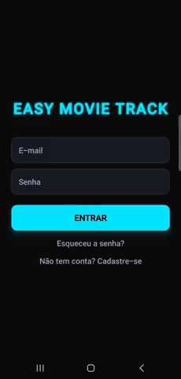
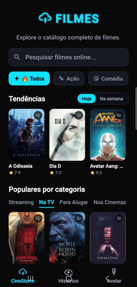
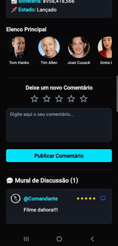

# 🎬 EasyMovieTrack

[](https://reactnative.dev/)
[](https://expo.dev/)
[](https://www.sqlite.org/)

O **EasyMovieTrack** é uma aplicação mobile completa para amantes do cinema gerenciarem suas listas de filmes assistidos, descobrirem novos títulos em alta e participarem de discussões em comunidade. 

---

## ▶️ Demonstração

*(Abaixo você pode ver o app rodando. Você pode substituir esses placeholders por GIFs ou imagens reais do seu app).*

<p align="center">
  <!-- Imagem 1: Tela de Login e Cadastro -->
  
  
  <!-- Imagem 2: Tela de Catálogo (API TMDB) -->
  
  
  <!-- Imagem 3: Tela do Mural (Fórum) -->
  
</p>

---

## 📱 Recursos e Funcionalidades

- **🔐 Autenticação Segura:** Sistema de cadastro e login com senhas criptografadas em hash SHA-256 no banco local.
- **🎬 Catálogo Inteligente:** Integração em tempo real com a API do TMDB para busca de filmes, detalhes, elenco e sinopses.
- **✅ Controle de Filmes Assistidos:** Marcação e gerenciamento de status de filmes com persistência local instantânea.
- **💬 Mural da Comunidade:** Sistema de fórum/discussão para filmes com suporte a respostas e threads aninhadas.
- **💾 Cache & Persistência Offline:** Banco de dados SQLite local garantindo navegação rápida e histórico sempre disponível.

---

## 🛠️ Tecnologias Utilizadas

- **Framework:** [React Native](https://reactnative.dev/) com [Expo (SDK 51)](https://expo.dev/)
- **Roteamento:** [Expo Router](https://docs.expo.dev/router/introduction/) (File-based routing)
- **Banco de Dados Local:** [Expo SQLite](https://docs.expo.dev/versions/latest/sdk/sqlite/)
- **Criptografia:** Expo Crypto (SHA-256)
- **Estilização:** StyleSheet nativo (Flexbox)

---

## 🗺️ Roadmap / Próximos Passos

Esta aplicação está em constante evolução. Os próximos grandes objetivos do projeto são:

1. **🖥️ Suporte Completo para Web (PWA):** Adaptar a aplicação para rodar no navegador, garantindo compatibilidade multiplataforma.
2. **📱 Layout Responsivo:** Implementar técnicas de design responsivo para que a interface se adapte perfeitamente a tablets e desktops.
3. **🌐 Banco de Dados em Nuvem (Sync):** Migrar de SQLite puro para uma solução híbrida ou sincronizada (ex: Firebase/Supabase) para permitir que o usuário acesse seus dados de qualquer dispositivo.

---

## 🚀 Como Executar o Projeto Localmente

### Pré-requisitos
- Node.js (versão 18 ou superior)
- Aplicativo **Expo Go** instalado no celular (ou um emulador Android/iOS)
- Chave/Token de Leitura da API do [TMDB](https://www.themoviedatabase.org/documentation/api)

---

## 🏗️ Arquitetura do Projeto

Abaixo está o mapeamento real da estrutura modularizada de arquivos do aplicativo:

```text
EasyMovieTrack/
├── app/                          # Roteamento Base (Expo Router)
│   ├── (tabs)/                   # Navegação por Abas Principais
│   │   ├── _layout.js            # Configuração, rotas e estilização visual da Tab Bar inferior
│   │   ├── history.js            # Aba: Histórico de filmes assistidos
│   │   ├── movies.js             # Aba: Catálogo e busca de filmes
│   │   └── profile.js            # Aba: Perfil e customização
│   ├── movie/                    # Sub-rotas dinâmicas
│   │   └── [id].js               # Detalhes, Sinalização e Mural
│   ├── _layout.js                # Provedor global e navegação raiz
│   ├── admin-users.js            # Painel Administrativo de gestão
│   ├── forgot-password.js        # Interface de recuperação de credenciais
│   ├── index.js                  # Ponto de entrada / Tela de Autenticação
│   ├── modal.js                  # Componentes auxiliares de pop-up
│   └── register.js               # Tela de Registro com Hash SHA256
├── src/                          # Módulos de Core Code e Serviços
│   ├── database/                 
│   │   └── initializeDatabase.js # Inicialização e Migrations das tabelas SQLite
│   ├── services/                 
│   │   ├── api.js                # Cliente Axios, Endpoints TMDB e Tradutor Fallback
│   │   ├── authSession.js        # Simulação e gerenciamento de sessão ativa
│   │   └── movieStorage.js       # Operações de persistência local de filmes e interações
│   └── styles/                   
│       └── globalStyles.js       # Design System unificado e estilização base
├── components/                   # Componentes atômicos reutilizáveis (botões, cards)
├── constants/                    # Paleta de cores (Theme.js) e tokens de UI
└── app.json                      # Configurações globais do ecossistema Expo
```

---

## 📦 Passo a Passo

Siga os passos abaixo para configurar o ambiente e executar o projeto localmente:

1. **Clonar o repositório**
   ```bash
      git clone [https://github.com/WendelFeSa/EasyMovieTrack.git](https://github.com/WendelFeSa/EasyMovieTrack.git)
   cd EasyMovieTrack
   ```
      
2. **Instalar as dependências**
   ```bash
      npm install
   ```

3. **Configurar as Variáveis de Ambiente**
Crie um arquivo .env na raiz do projeto e insira o seu token de leitura da API do TMDB
   ```bash
      EXPO_PUBLIC_TMDB_TOKEN=seu_token_jwt_aqui
   ```

4. **Iniciar o servidor do Expo**
   ```bash
      npx expo start
   ```

---

## 📱 Visualização e Testes

No terminal gerado pelo Expo CLI, você poderá escolher o ambiente de renderização:

Pressione a para abrir no emulador Android.

Pressione i para abrir no simulador iOS.

Leia o QR Code exibido no terminal utilizando o aplicativo Expo Go em seu dispositivo físico.


> **Nota:** Para testar as requisições à API e sincronização nativa via Expo Go no celular físico, certifique-se de que o computador de desenvolvimento e o smartphone estejam conectados exatamente à mesma rede Wi-Fi.

---

## 👤Desenvolvedor

Desenvolvido por Wendel Ferreira Santos

Entre em contato ou confira mais projetos:

- GitHub: @WendelFeSa

- LinkedIn: www.linkedin.com/in/wendelf-santos